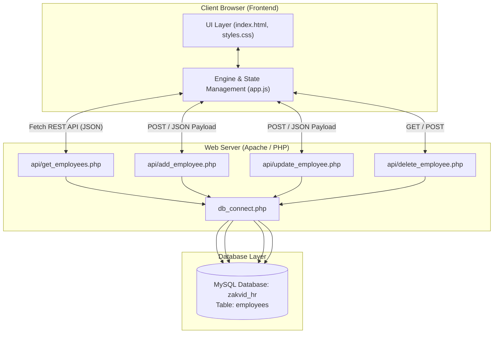

# 🏢 ZAKVID HR — Enterprise Workforce Management System

An enterprise-grade, responsive Employee Management Dashboard built with **HTML5, CSS3 (Vanilla Glassmorphism), JavaScript (ES6+)**, a **PHP REST API backend**, and a **MySQL database**.

---

## 📐 System Architecture



---

## 📁 Repository Structure

```
employee-system/
│
├── index.html            # Single Page Application (SPA) HTML5 layout
├── styles.css            # Custom CSS3 styling with glassmorphism & dark/light theme
├── app.js                # Core JS logic: Async HTTP Requests, State Engine & DOM rendering
├── sample-data.js        # Fallback sample employee dataset
│
├── api/                  # PHP REST API Endpoints
│   ├── db_connect.php    # MySQLi Database Connection Configuration
│   ├── get_employees.php # Read: Fetch all employee records (JSON)
│   ├── add_employee.php  # Create: Insert new employee record
│   ├── update_employee.php# Update: Modify existing employee record
│   └── delete_employee.php# Delete: Remove employee record by ID
│
└── database/             # Database DDL & Schema Scripts
    └── schema.sql        # MySQL table schema and sample data insert queries
```

---

## 🔄 How the Frontend & Backend Work Together

The system follows a **decoupled Client-Server architecture** using RESTful API communication over JSON:

### 1. Initial Page Load (Fetch & Render)
1. When `index.html` loads, `app.js` triggers the `DOMContentLoaded` event.
2. `app.js` executes `fetchEmployees()` which makes an asynchronous HTTP `GET` request to `api/get_employees.php`.
3. `get_employees.php` includes `db_connect.php`, queries the MySQL database (`SELECT * FROM employees ORDER BY created_at DESC`), and returns a JSON array of employee objects.
4. `app.js` parses the JSON, updates its internal state array `employees`, calculates dynamic workforce metrics (Total Employees, Department Breakdown, Active/Remote stats), and dynamically renders the Employee Grid / Table views.

### 2. Adding a New Employee
1. User completes the **Add Employee** form on the frontend.
2. `app.js` executes real-time Client-Side validation (email format checks, salary input checks, required fields).
3. `app.js` submits an asynchronous `POST` request with a JSON payload to `api/add_employee.php`.
4. `add_employee.php` performs Server-Side validation, prepares a MySQL statement (`INSERT INTO employees...`), and stores skills array as a JSON string in MySQL.
5. On HTTP 200 response, `app.js` displays a success toast notification, resets the form, switches to the directory view, and re-fetches the updated workforce list.

### 3. Updating Employee Records
1. Clicking **Edit** opens a slide-over drawer populated with the selected employee's current details.
2. Submitting changes sends a `POST` request to `api/update_employee.php` with the employee `id` and modified fields.
3. `update_employee.php` updates the record in MySQL using prepared statements (`UPDATE employees SET ... WHERE id = ?`).
4. `app.js` receives the JSON response, closes the drawer, and refreshes the workforce view.

### 4. Deleting an Employee
1. Clicking **Delete** triggers a modal confirmation prompt.
2. Confirming sends a request to `api/delete_employee.php` with the employee `id`.
3. `delete_employee.php` executes `DELETE FROM employees WHERE id = ?`.
4. On success, `app.js` updates state and notifies the user with an animated toast.

---

## 🗄️ Database Schema (`zakvid_hr`)

The application relies on the `employees` table in MySQL:

```sql
CREATE TABLE IF NOT EXISTS employees (
    id VARCHAR(20) PRIMARY KEY,
    fullName VARCHAR(100) NOT NULL,
    email VARCHAR(100) NOT NULL UNIQUE,
    phone VARCHAR(20),
    location VARCHAR(100) DEFAULT 'Bengaluru',
    department VARCHAR(50) NOT NULL,
    designation VARCHAR(100) NOT NULL,
    salary INT NOT NULL,
    joiningDate DATE NOT NULL,
    workMode ENUM('Remote', 'On-Site', 'Hybrid') DEFAULT 'Remote',
    status ENUM('Active', 'On Leave', 'Inactive') DEFAULT 'Active',
    avatarColor VARCHAR(100) DEFAULT 'linear-gradient(135deg, #a855f7 0%, #d946ef 100%)',
    skills JSON NULL,
    created_at TIMESTAMP DEFAULT CURRENT_TIMESTAMP
);
```

---

## 🛠️ Local Environment & Running Instructions

### Prerequisites
- **Web Server**: Apache (XAMPP / WAMP / Laragon)
- **PHP**: PHP 7.4+ or PHP 8.x with `mysqli` extension enabled
- **Database**: MySQL 5.7+ or MariaDB

### Step-by-Step Setup
1. **Clone or Place Repository in Web Root**:
   Place the project directory inside your XAMPP `htdocs` directory (e.g., `C:\xampp\htdocs\employee-system`).

2. **Import Database Schema**:
   - Open **phpMyAdmin** (`http://localhost/phpmyadmin/`).
   - Create a new database named `zakvid_hr`.
   - Import the `database/schema.sql` file.

3. **Configure Database Connection**:
   Update `api/db_connect.php` if your MySQL username, password, or port differ from defaults:
   ```php
   $host = "127.0.0.1";
   $username = "root";
   $password = "";
   $database = "zakvid_hr";
   $port = 3307; // Change port if needed (default MySQL port is 3306)
   ```

4. **Run the Website**:
   Open your browser and navigate to:
   ```
   http://localhost/employee-system/
   ```

---

## 🌟 Key Features

- 🎨 **Glassmorphism UI & Dark/Light Mode**: Smooth theme toggling persisted in `localStorage`.
- 📊 **Dynamic Analytics Dashboard**: Real-time stats for total headcount, active employees, remote ratio, and department distribution.
- 🔎 **Real-time Filtering & Search**: Instant searching by name, email, department, work mode, and sorting options.
- 📱 **Responsive Design**: Works across mobile, tablet, and desktop viewports.
- 🔒 **Prepared Statements**: PHP API uses parameterized queries (`mysqli_prepare`) to prevent SQL injection vulnerabilities.
